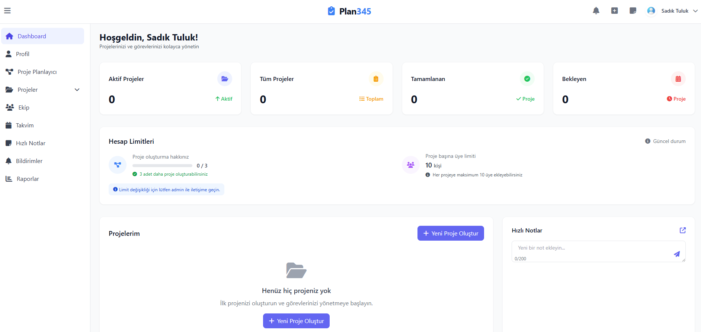
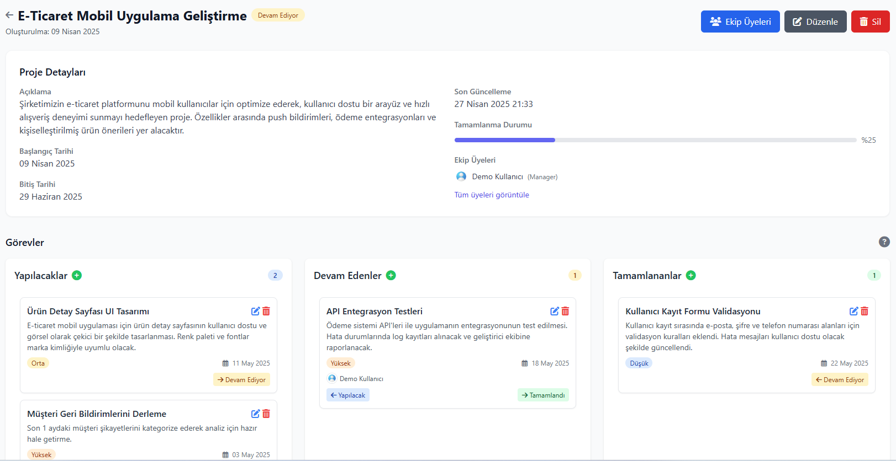

# Plan345

<div align="center">
  
  <h3>Modern Proje Yönetim Platformu</h3>
  <p>Ekibinizle birlikte projelerinizi kolayca yönetin, görevleri organize edin ve verimliliğinizi artırın.</p>
  
  [](https://dotnet.microsoft.com/download/dotnet/6.0)
  [](https://www.microsoft.com/en-us/sql-server)
  [](https://dotnet.microsoft.com/apps/aspnet/signalr)
  [](https://dotnet.microsoft.com/apps/aspnet)
</div>

## 📋 İçindekiler

- [Proje Tanıtımı](#-proje-tanıtımı)
- [Temel Özellikler](#-temel-özellikler)
- [Ekran Görüntüleri](#-ekran-görüntüleri)
- [Teknoloji Yığını](#-teknoloji-yığını)
- [Kurulum ve Çalıştırma](#-kurulum-ve-çalıştırma)
- [Kullanım](#-kullanım)
- [Katkıda Bulunma](#-katkıda-bulunma)
- [Lisans](#-lisans)
- [İletişim](#-iletişim)

## 🚀 Proje Tanıtımı

Plan345, iş akışını optimize etmek ve ekip işbirliğini geliştirmek için tasarlanmış modern bir proje yönetim platformudur. 2020 yılından bu yana, şirketlerin dijital dönüşüm süreçlerinde yanında olarak, proje yönetimi alanında yenilikçi çözümler sunmaktadır. Gerçek zamanlı güncellemeler, sezgisel görev yönetimi ve ekip işbirliği özellikleriyle projelerin zamanında ve bütçe dahilinde tamamlanmasını kolaylaştırır.

## ✨ Temel Özellikler

- **Sürükle & Bırak Kanban Tahtası**: Görevleri kolayca organize edin ve iş akışınızı görselleştirin
- **Gerçek Zamanlı İşbirliği**: SignalR teknolojisi ile ekip üyeleri arasında anlık güncellemeler
- **Ekip İşbirliği Araçları**: Projelere ekip üyelerini ekleyin, izinleri yönetin ve iletişimi güçlendirin
- **İlerleme Takibi ve Analizler**: Proje ilerlemesini ölçün ve detaylı raporlar alın
- **Takvim Entegrasyonu**: Proje takvimini planlayın ve önemli tarihleri takip edin
- **Görev Yönetimi**: Görevleri oluşturun, düzenleyin ve farklı durumlara atayın
- **Bildirim Sistemi**: Önemli proje etkinlikleri için otomatik bildirimler
- **Hızlı Notlar**: Önemli bilgileri kaydetmek için not alma özelliği
- **Kullanıcı Yönetimi**: Kapsamlı rol ve izin sistemi
- **Raporlama**: Proje ve görev durumlarıyla ilgili detaylı raporlar
- **Mobil Uyumlu Tasarım**: Her cihazda kusursuz çalışma deneyimi

## 📱 Ekran Görüntüleri

<div align="center">
  
  
</div>

## 🛠️ Teknoloji Yığını

### Backend
- **ASP.NET Core 6.0 MVC**: Güçlü ve modern web uygulama çerçevesi
- **Entity Framework Core**: Veritabanı işlemleri için ORM
- **ASP.NET Core Identity**: Kimlik doğrulama ve yetkilendirme
- **SignalR**: Gerçek zamanlı web işlevselliği
- **SQL Server**: İlişkisel veritabanı
- **Background Services**: Arka plan görevleri ve temizleme işlemleri

### Frontend
- **HTML5, CSS3, JavaScript**: Modern web standartları
- **jQuery**: DOM manipülasyonu ve AJAX istekleri
- **Tailwind CSS**: Responsive tasarım için UI çerçevesi
- **SortableJS**: Sürükle-bırak işlevselliği

### Güvenlik
- **HTTPS Uygulama**: Güvenli iletişim
- **KVKK Uyumluluğu**: Kişisel verilerin korunması
- **İki Faktörlü Kimlik Doğrulama**: Hesap güvenliği
- **E-posta Doğrulama**: Kullanıcı hesap doğrulama
- **Şifre Politikaları**: Güçlü şifre gereksinimleri

## 💻 Kurulum ve Çalıştırma

### Gereksinimler

- .NET 6.0 SDK veya üzeri
- SQL Server 2019 veya üzeri
- Visual Studio 2022 veya VS Code

### Adımlar

1. Projeyi klonlayın:
   ```bash
   git clone https://github.com/sadikcantuluk/Plan345.git
   cd Plan345
   ```

2. `appsettings.json` dosyasında veritabanı bağlantı dizesini yapılandırın:
   ```json
   "ConnectionStrings": {
     "DefaultConnection": "Server=YOUR_SERVER;Database=Plan345DB;Trusted_Connection=True;MultipleActiveResultSets=true"
   }
   ```

3. E-posta servisini ayarlayın:
   ```json
   "EmailSettings": {
     "Mail": "your-email@example.com",
     "DisplayName": "Plan345",
     "Password": "your-email-password",
     "Host": "smtp.example.com",
     "Port": 587
   }
   ```

4. Veritabanını oluşturun:
   ```bash
   dotnet ef database update
   ```

5. Uygulamayı başlatın:
   ```bash
   dotnet run
   ```

6. Tarayıcınızda `https://localhost:7091` adresini açın.

## 📝 Kullanım

1. Hesap oluşturun veya mevcut hesabınızla giriş yapın.
2. Yeni bir proje oluşturun ve ekip üyelerini davet edin.
3. Projelere görevler ekleyin ve atamalar yapın.
4. Görevleri kanban tahtasında sürükleyip bırakarak durumlarını güncelleyin.
5. Proje aktivitelerini ve ekip üyelerinin güncellemelerini gerçek zamanlı olarak takip edin.
6. Raporlar bölümünden proje ilerleme durumunu analiz edin.
7. Takvim görünümünde önemli tarihleri ve görevleri planlayın.

## 👥 Katkıda Bulunma

1. Bu depoyu forklayın
2. Yeni özellik dalınızı oluşturun (`git checkout -b feature/AmazingFeature`)
3. Değişikliklerinizi commit edin (`git commit -m 'Add some AmazingFeature'`)
4. Dalınıza push yapın (`git push origin feature/AmazingFeature`)
5. Pull request oluşturun

## 📄 Lisans

Bu proje [MIT Lisansı](LICENSE) altında lisanslanmıştır.

## 📞 İletişim

- **Web Sitesi**: [https://plan345.com](https://plan345.com)
- **Proje Destek**: [plan345destek@gmail.com](mailto:plan345destek@gmail.com)
- **Geliştirici İletişim**: [sadikcantuluk@gmail.com](mailto:sadikcantuluk@gmail.com)
- **Proje Repository**: [https://github.com/sadikcantuluk/Plan345](https://github.com/sadikcantuluk/Plan345)

---

<div align="center">
  <p>© 2023 Plan345. Tüm hakları saklıdır.</p>
  <p>
    <a href="#">Gizlilik Politikası</a> •
    <a href="#">Kullanım Koşulları</a> •
    <a href="#">KVKK</a>
  </p>
</div> 
